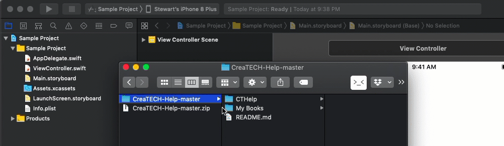

# CreaTECH-Help
CreaTECH Help (CTHelp) is a Help system for iOS/Swift


### Installation

Drag the CTHelp folder into your project



#### Usage

------

#### Quick Start

------

Add a button to your view and link the action to a function that sets up and presents the CTHelp view controller.

```swift
func showCTHelp() {
   let ctHelp = CTHelp()
   ctHelp.new(CTHelpItem(title:"No Text-Image Only",
                         helpText: "",
                         imageName:"SampleFullSizeImage"))
   ctHelp.new(CTHelpItem(title:"Text and Image",
                         helpText: "Lorem ipsum dolor sit amet, consectetur adipiscing elit,
                         imageName:"SampleSmallerImage"))
   ctHelp.new(CTHelpItem(title:"No Image-Text Only",
                         helpText: "Eu tempor suscipit dis sed. Tortor velit orci bibendum mattis non metus ornare consequat. Condimentum habitasse dictumst eros nibh rhoncus non pulvinar fermentum. Maecenas convallis gravida facilisis. Interdum, conubia lacinia magnis duis nec quisque.Excepteur sint occaecat cupidatat non proident, sunt in culpa qui officia deserunt mollit anim id est laborum.",
                         imageName:""))
 // Optional addition of two default cards
   ctHelp.appendDefaults(companyName: "Your Company", emailAddress: "somewhere@somewhere.com", data: nil, webSite: "https://www.somewhere.com/", companyImageName: "Some Company")

   ctHelp.presentHelp(from: self)
}
```

The above will create 3 help cards + 2 defaults (link to web and support email)

### Resources:

------

### Todo

Installation and Configuration video (YouTube)

https://www.youtube.com/watch?v=7Gh5uFJ5h1g

Medium Blog

[https://medium.com/@stewartlynch/adding-help-to-your-ios-app-7d53053fb563](https://medium.com/@stewartlynch/adding-help-to-your-ios-app-7d53053fb563)